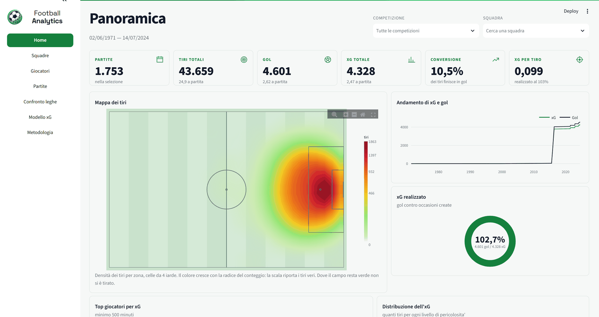
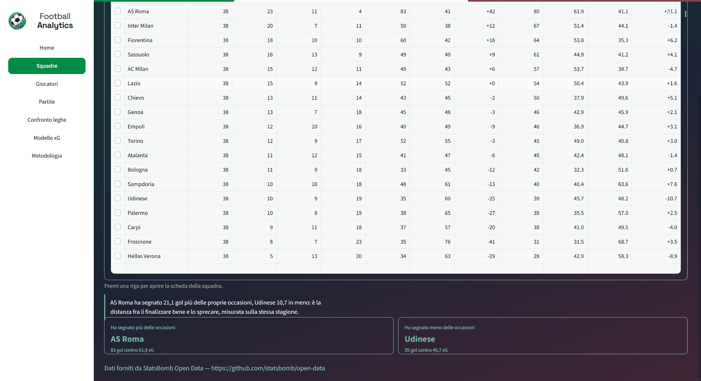
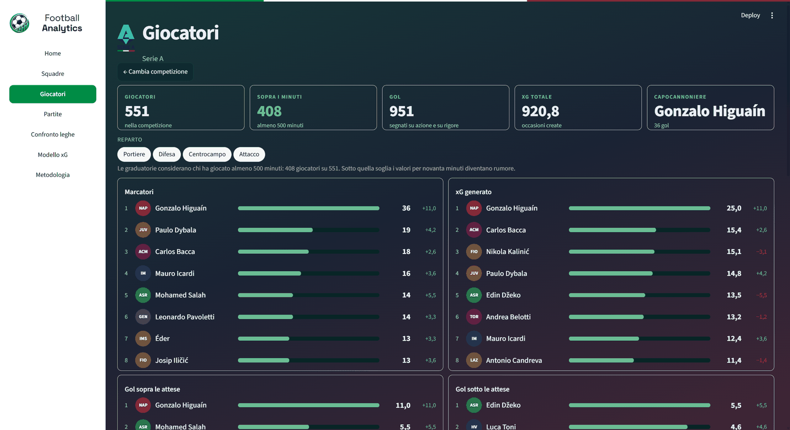
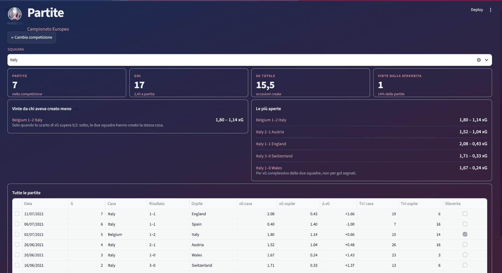
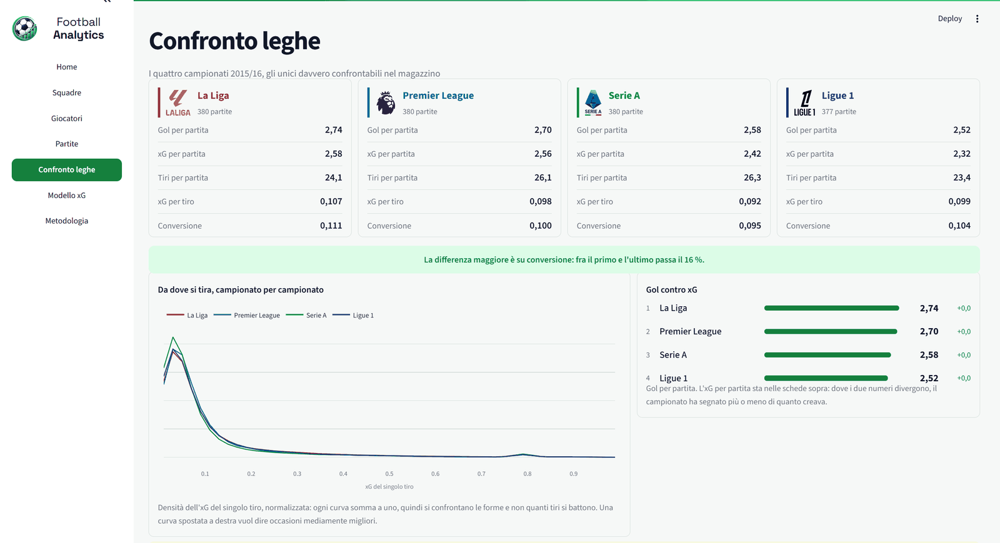
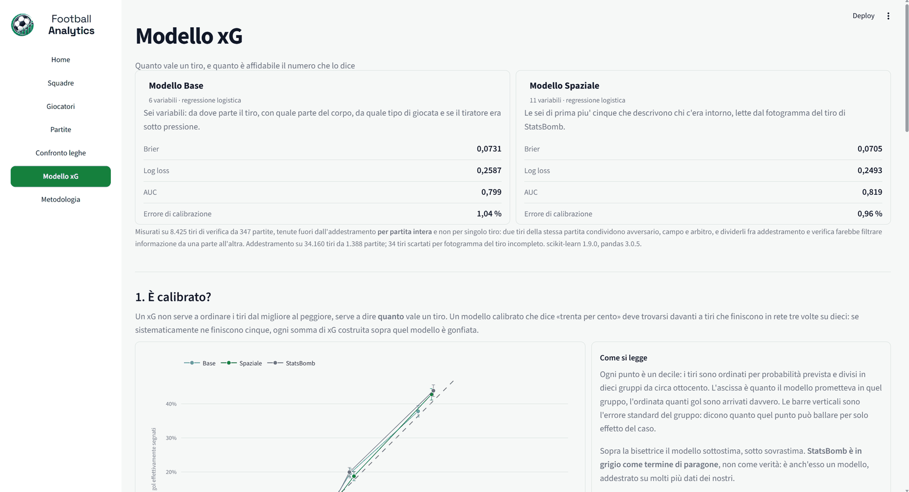
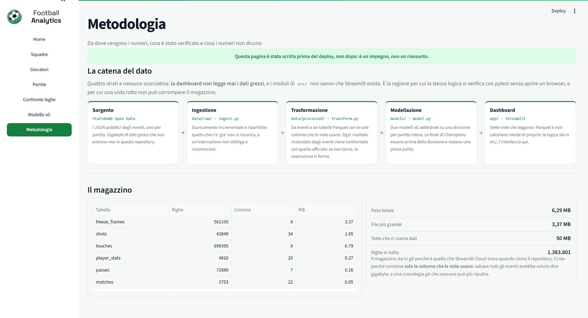
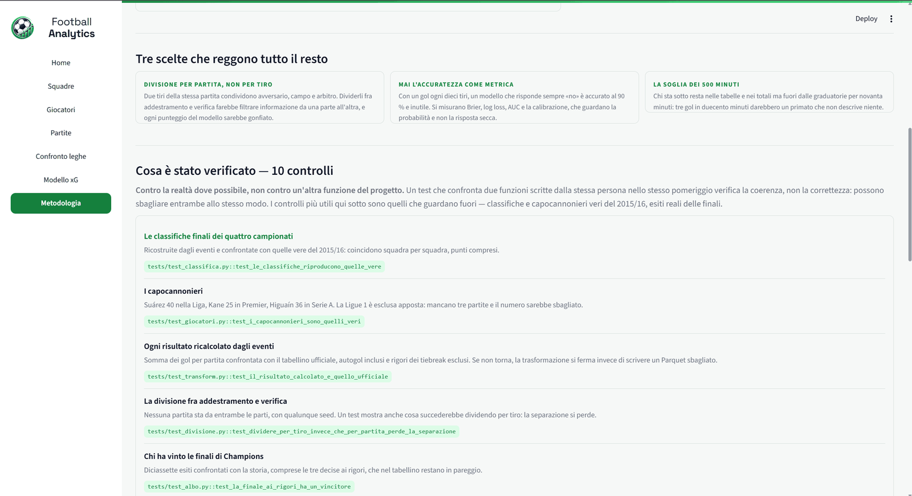
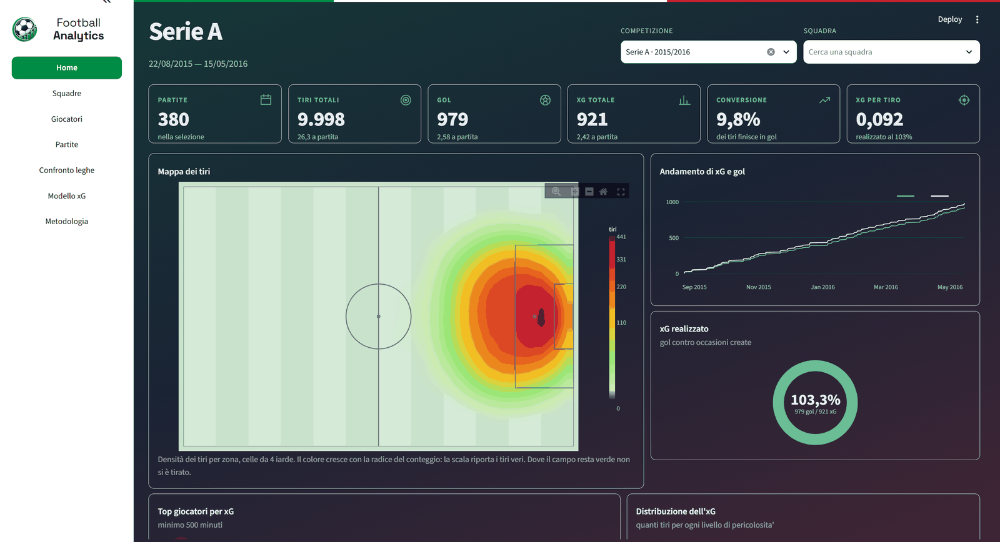
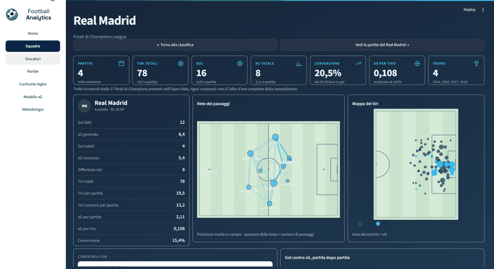

# M6 — Dashboard

> Prima di questa milestone il progetto sapeva rispondere a delle domande ma
> non sapeva mostrarle: c'erano un magazzino Parquet, due modelli xG e una
> suite di test. Ora c'è una dashboard di sette viste che si apre con un
> comando, cambia colore con la competizione scelta, e dichiara in pagina cosa
> i suoi numeri non dicono.

**Issue chiuse:** 14 su 14, di cui una chiusa per altra via ·
**Viste:** 7 nel menu, 10 script di pagina · **Righe in `app/`:** 4.612

---

## 1. Cosa è stato costruito

Una dashboard Streamlit che legge il magazzino costruito a M3 e i modelli
addestrati a M5, e non calcola quasi niente per conto proprio.

Sette viste raggiungibili dal menu — Home, Squadre, Giocatori, Partite,
Confronto leghe, Modello xG, Metodologia — più tre pagine di dettaglio in cui
si entra premendo una riga: la scheda di una squadra, quella di un giocatore,
quella di una partita. Il tema cambia da solo con la competizione scelta, con
nove palette e nessun colore scritto dentro il codice che disegna.

**La cosa che distingue questa dashboard da una qualsiasi** non sono i
grafici: è che ogni vista dichiara i propri limiti dove il limite si incontra.
L'albo d'oro dice di non essere l'albo d'oro della Champions League; la scheda
di un portiere spiega perché è ridotta; il confronto fra campionati dice che la
Ligue 1 ha 377 partite; la vista Metodologia raccoglie tutti gli undici limiti
in un posto solo, ognuno con la conseguenza pratica.

---

## 2. Le sette viste, e perché quest'ordine

L'ordine del menu non segue quello in cui le viste sono state costruite: segue
**il livello di zoom**. Si parte da tutto, si stringe fino al singolo tiro, e
solo alla fine si guarda lo strumento che ha prodotto i numeri.

### Home — la panoramica



Tutto il magazzino, o una competizione, o una squadra dentro una competizione.
Sei indicatori, la mappa di calore dei tiri, l'andamento di gol e xG, l'anello
dell'xG realizzato, la distribuzione dell'xG per tiro e le frasi calcolate.
È l'unica vista che accetta «tutte le competizioni», e serve a dare l'ordine di
grandezza prima di qualunque dettaglio.

### Squadre — la classifica con gli xG accanto



*La parte bassa della Serie A 2015/16, con la frase calcolata sotto la tabella.*

Una classifica si trova ovunque; una classifica con di fianco quanti gol una
squadra *avrebbe dovuto* segnare no. È anche l'unica vista le cui cifre hanno
un riscontro esterno: i punti del 2015/16 coincidono con quelli veri, e un test
lo controlla a ogni esecuzione.

Dove non c'è un girone all'italiana la classifica **sparisce** invece di
mostrare una tabella senza significato.

### Giocatori — la graduatoria e la soglia



Quattro graduatorie e una tabella completa. La soglia dei 500 minuti esclude
dalle graduatorie senza togliere dalla tabella: chi ha segnato tre gol in
duecento minuti resta nei totali ma non guida una classifica per novanta
minuti.

### Partite — l'elenco e il dettaglio



Ogni partita con xG di casa e trasferta, chi ha ribaltato il pronostico, quali
sono state le più aperte. Premendo una riga si apre la partita con la mappa dei
tiri e l'xG cumulato minuto per minuto.

### Confronto leghe — i quattro campionati affiancati



L'unica vista senza scelta della competizione, ed è voluto: il confronto fra
campionati è il contenuto della pagina, non un filtro. Tutti i numeri sono per
partita o per tiro, mai totali, perché la Ligue 1 ha 377 partite invece di 380.

### Modello xG — come funziona e quanto vale



Quattro blocchi nell'ordine in cui un tecnico si fa le domande: è calibrato,
cosa guarda, le variabili spaziali servono, regge fuori dal campione. Nessun
numero è calcolato qui: arrivano tutti da `docs/milestones/M5-risultati.json`.

### Metodologia — da dove vengono i numeri



Catena del dato in cinque riquadri, il magazzino con righe e peso letti dai
metadati, dieci verifiche ognuna con il test che la regge, undici limiti ognuno
con la conseguenza pratica, e l'attribuzione a StatsBomb per esteso.

**Questa è la parte che distingue la pagina da una dichiarazione di intenti:**
ogni verifica porta il riferimento pytest in forma `file::funzione`, si copia e
si controlla in dieci secondi.



---

## 3. File creati e modificati

| File | Cosa fa |
| --- | --- |
| `src/football_analytics/tema.py` | Nove palette con i campi nominati per **ruolo**, non per colore |
| `src/football_analytics/viz.py` | Campo, mappe, radar, densità, calibrazione, barre divergenti |
| `src/football_analytics/panoramica.py` | KPI, zone, quarti d'ora, andamento |
| `src/football_analytics/classifica.py` | La classifica ricostruita dai risultati |
| `src/football_analytics/squadre.py` | Sigle e colori delle squadre |
| `src/football_analytics/albo.py` | L'albo d'oro ricavato dalle finali, rigori compresi |
| `src/football_analytics/giocatori.py` | Reparti, percentili, graduatorie, soglia |
| `src/football_analytics/partite.py` | Elenco, ribaltate, corsa dell'xG |
| `src/football_analytics/passaggi.py` | La rete dei passaggi |
| `src/football_analytics/leghe.py` | Il confronto fra i quattro campionati |
| `src/football_analytics/rendiconto.py` | Legge i numeri congelati di M5, non li ricalcola |
| `src/football_analytics/metodo.py` | Catena, verifiche e limiti della vista Metodologia |
| `src/football_analytics/insights.py` | Le frasi calcolate dalla selezione |
| `app/Panoramica.py` | La Home, e lo script principale di Streamlit |
| `app/guscio.py` | Menu, filtri, indicatori, foglio di stile — condivisi da tutte le viste |
| `app/dati.py` | L'unico punto in cui il progetto legge un Parquet |
| `app/theme.py` | Inietta il tema nella pagina |
| `app/pages/*.py` | Le altre nove pagine |

Tredici moduli in `src/` per 5.228 righe, quattordici script in `app/` per
4.612. Il rapporto è voluto: **la logica sta sotto, l'interfaccia sopra.**

---

## 4. Decisioni tecniche

### Scelta: il tema cambia con la competizione, e nessun colore vive nei grafici

`Tema` è una dataclass i cui campi sono nominati per **ruolo** — `primario`,
`superficie`, `pericolo`, `atteso` — e non per colore. È ciò che permette di
scrivere un grafico una volta sola e vederlo cambiare tema senza toccarlo:
`primario` resta `primario` quando diventa blu.

Le stesse pagine, con due competizioni diverse. Cambia **tutto**: il fondo, la
fascia in cima, l'accento dei numeri, le linee dei grafici, l'anello, le barre
delle classifiche, perfino il colore delle icone — che sono SVG scritti a mano
con `currentColor`, e prendono la tinta del tema senza che nessuno gliela dica.

L'unica cosa che resta ferma è **l'erba del campo**, verde in tutti e nove i
temi: un campo blu si legge come un errore di rendering, non come una scelta.





Il meccanismo è tutto qui:

```python
# app/theme.py
def applica(gruppo: str | Gruppo | None = None, competizione: str | None = None) -> Tema:
    tema = per_competizione(competizione) if competizione else per_gruppo(gruppo or "")
    st.markdown(foglio_di_stile(tema), unsafe_allow_html=True)
    return tema
```

Tre righe che fanno tre cose. Scelgono la palette dalla competizione — la
competizione ha la precedenza sul gruppo perché è l'informazione più precisa.
Iniettano il foglio di stile, che è il modello in `guscio.MODELLO` vestito di
quei colori. E **restituiscono il tema**, che ogni pagina passa alle funzioni di
disegno: così i grafici usano gli stessi colori della pagina senza doverli
conoscere.

Ogni vista comincia con le stesse due righe:

```python
tema = theme.applica(dati.gruppo_di(competizione, dati.leggi("matches")), competizione)
st.markdown(foglio(tema), unsafe_allow_html=True)
```

**Alternativa scartata:** un file CSS statico con un tema solo, e i colori dei
grafici scritti dentro `viz.py`.

**Perché:** con i colori sparsi nei grafici, cambiare tema avrebbe voluto dire
cercarli uno per uno, e il primo dimenticato sarebbe rimasto verde su fondo blu
senza che niente lo segnalasse. Due test lo impediscono:
`test_nessun_colore_letterale_fuori_da_tema` rifiuta qualunque esadecimale nei
moduli di disegno, e `test_il_test_saprebbe_riconoscere_un_colore` verifica che
quel controllo sappia davvero accorgersene — un test che non fallisce mai non
protegge niente.

Nove palette: neutro, Premier, Liga, Serie A, Ligue 1, Coppa d'Africa, Europei,
Mondiali, e il blu delle finali di Champions. Un test verifica che ogni
competizione del magazzino abbia il proprio tema distinto, un altro che il testo
si legga sul fondo in tutti e nove.

### Scelta: Plotly invece di mplsoccer

**Alternativa scartata:** `mplsoccer`, che disegna campi da calcio già pronti ed
è la libreria che chiunque userebbe per questo progetto.

**Perché:** mplsoccer produce immagini statiche di matplotlib. In una dashboard
questo significa nessun hover, nessuno zoom, e un'immagine rigenerata da capo a
ogni interazione — su Streamlit, che riesegue lo script a ogni clic, è il caso
peggiore. Con Plotly la mappa dei tiri si può ingrandire su una zona, e
passando sopra un punto si legge chi ha tirato e quanto valeva quel tiro.

Il prezzo è che il campo va disegnato a mano, ed è il motivo per cui
`viz.campo()` esiste: **una funzione sola per tutte le viste.** Se ogni grafico
disegnasse il proprio campo, prima o poi due viste avrebbero proporzioni diverse
e lo stesso tiro apparirebbe in due punti diversi dell'app — un difetto
invisibile a chi scrive e ovvio a chi guarda.

Le misure — porta, pali, area — sono **importate da `features.py`**, non
ricopiate: sono le stesse che il modello usa per calcolare distanza e angolo, e
un test verifica che le due copie non esistano.

### Scelta: la soglia dei 500 minuti esclude dalle graduatorie, non dalla tabella

**Alternativa scartata:** filtrare via chi sta sotto la soglia, oppure non avere
soglia.

**Perché:** senza soglia, la classifica dei gol ogni 90 minuti la guida sempre
una riserva che ha segnato tre gol in duecento minuti — vero e inutile. Ma
togliere quei giocatori dalla tabella li farebbe sparire anche dai totali, e i
conti non tornerebbero più con la Home.

La soglia è dichiarata una volta in `config.SOGLIA_MINUTI` e un test verifica
che le pagine non ne tengano una copia. Nelle finali di Champions **nessuno la
raggiunge** — il massimo è 432 minuti — e la vista lo dice invece di mostrare
graduatorie vuote.

### Scelta: la dashboard non ricalcola i numeri del modello, li legge

La vista Modello xG legge `docs/milestones/M5-risultati.json` e le due schede in
`models/`. Non addestra niente e non carica nessun `.pkl`.

**Alternativa scartata:** ricalcolare calibrazione e metriche al volo.

**Perché:** due ragioni, e la prima è di onestà. Se la dashboard ricalcolasse la
calibrazione, prima o poi mostrerebbe un valore diverso da quello scritto nella
documentazione di M5, e nessuno saprebbe quale dei due credere. Leggendo lo
stesso file, i due non possono divergere. La seconda è pratica: un `.pkl` è
Python serializzato, e **caricarlo esegue codice** — una pagina che si limita a
leggere JSON funzionerà su Streamlit Cloud senza aprire quella superficie.

### Scelta: le frasi si calcolano, non si scrivono

`insights.py` produce frasi come «in 380 partite si sono visti 979 gol, 2,58 a
partita» a partire dai numeri della selezione. Nessun testo fisso che possa
diventare falso cambiando filtro.

Il nome della competizione compare **come etichetta davanti a un trattino, non
come soggetto della frase**. Metterlo come soggetto obbligherebbe a conoscere
genere e numero di ogni competizione per far tornare la concordanza, e la prima
stesura infatti produceva «le finali di Champions **ha** segnato».

Un test estrae ogni cifra dal testo e la ricalcola dai dati: una frase con
dentro un numero rimasto da un'altra competizione supererebbe qualunque altro
controllo.

### Scelta: un solo punto legge dal disco

`pd.read_parquet` compare **una volta sola in tutto `app/`**, dentro
`dati.leggi`, che è sotto `@st.cache_data`. Un test lo impone leggendo i
sorgenti.

**Perché:** Streamlit riesegue lo script da capo a ogni interazione. Senza
cache, ogni clic rileggerebbe 43.849 righe di tiri, e su Streamlit Cloud — meno
di un gigabyte di RAM — sarebbe il modo più rapido per far morire l'app al primo
utente che tocca un filtro.

---

## 5. Cosa Streamlit non ha permesso di fare

Questa sezione esiste perché il modello di milestone la chiede, e perché è la
parte che di solito non si scrive.

### Lo stato dei widget non sopravvive al cambio pagina

Streamlit **scarta lo stato dei widget che non vengono più disegnati**. La Home
sceglie la competizione con un menu a tendina e Squadre con dei pulsanti: due
widget diversi con la stessa chiave si azzerano a vicenda, e la selezione
spariva passando da una vista all'altra.

**Come ci si convive:** chiavi di consegna che non appartengono a nessun widget
— `apri_competizione`, `apri_squadra`, `apri_partita`, `apri_giocatore` — che si
scrivono prima del salto e si leggono dopo, consumandole con `pop`. Le coppie
consegna-filtro stanno in una costante sola: erano ripetute in due funzioni, e
aggiungendone una bisognava toccarle entrambe.

### I delta arrivano un elemento alla volta

Cambiando pagina, per qualche centinaio di millisecondi si vedeva un pezzo di
barra laterale della pagina precedente insieme a quella nuova. Non è un difetto
del codice: Streamlit applica le modifiche un elemento per volta, e durante la
transizione la finestra contiene entrambi gli stati.

**Come ci si convive:** un solo `st.empty()` che viene riempito, invece di più
elementi disegnati in sequenza. Un contenitore che si sostituisce in blocco non
può mostrare metà del vecchio e metà del nuovo.

### `st.pills` non è pilotabile da `AppTest`

La suite non riesce a premere quel componente. I test che ne hanno bisogno
scrivono direttamente in `session_state`, il che verifica il comportamento ma
non il clic.

**Come ci si convive:** è un buco dichiarato. Quei percorsi restano verificati a
occhio, e la scelta di dichiararlo qui è preferibile a un test che sembra
coprire qualcosa e non lo copre.

### Niente JavaScript in `st.markdown`

I tag `<script>` vengono rimossi. Un contatore che fa salire i numeri da zero
non si può fare senza `components.html`, che mette il pezzo in un iframe
separato: perderebbe tema, caratteri e allineamento con il resto della pagina.

**Come ci si convive:** i numeri compaiono con il riquadro che li contiene.
L'effetto è meno vistoso e il prezzo era troppo alto.

### `use_container_width` è scaduto

Streamlit lo accetta ancora ma lo segnala a ogni chiamata. Un avviso ignorato è
un errore rimandato: un test rifiuta quel parametro nei sorgenti, così il
fallimento arriva adesso invece che al prossimo aggiornamento.

---

## 6. Numeri misurati

| Cosa | Valore | Come è stato ottenuto |
| --- | --- | --- |
| Viste nel menu | 7 | `guscio.MENU`, e un test impone che nessuna resti spenta |
| Script di pagina | 10 | 7 viste più 3 pagine di dettaglio |
| Righe in `app/` | 4.612 | conteggio sui sorgenti |
| Righe nei moduli `src/` di M6 | 5.228 | conteggio sui tredici moduli |
| Palette | 9 | `tema.py`, una per competizione più il neutro |
| Peso del magazzino letto | 6,29 MB | metadati dei sei Parquet |
| Letture dal disco per sessione | 1 per tabella | contatore su `pd.read_parquet` durante l'uso |
| Punti di lettura dal disco in `app/` | 1 | `dati.leggi`, verificato sui sorgenti |
| Durata massima di un'animazione | 220 ms | variabili CSS, con un test che le tiene sotto 300 |
| Limiti dichiarati in Metodologia | 11 | `metodo.LIMITI` |
| Verifiche citate con il loro test | 10 | `metodo.VERIFICHE`, nessuna orfana |
| Test automatici | 703 — misurati a M7 | `uv run python -m pytest -q -m "not rete"` |

---

## 7. Problemi incontrati

### La classifica era giusta e il capocannoniere no

Éder compariva due volte nella Serie A, con metà dei suoi gol ciascuna. Il
magazzino ha una riga per (competizione, giocatore, **squadra**), e un
trasferimento di metà stagione produce due righe. Sono 83 le righe interessate.

Sommate per giocatore in tutte le viste; le due squadre restano scritte, perché
è un'informazione vera.

### La Fiorentina nell'albo d'oro della Champions League

La competizione `champions_finali` contiene diciotto partite ma **diciassette
finali**: Fiorentina — Manchester United del 23 novembre 1999 ha `fase` uguale a
`1st Round`. Filtrare per competizione invece che per fase la metteva fra le
finaliste.

### Tre coppe sparite

Le finali del 2005, 2012 e 2016 sono finite ai rigori e nel tabellino restano in
pareggio. Il vincitore si ricava dai tiri con `rigori_finali`, che nel magazzino
ci sono: senza, tre coppe non venivano assegnate e nessuno se ne accorgeva
guardando la pagina. Diciassette esiti confrontati con la storia, tutti
coincidenti.

### Un'affermazione falsa scritta in pagina e corretta due giorni dopo

L'avvertenza del Confronto leghe diceva che senza i dati 360 l'xG è stimato
«senza sapere dove fossero difensori e portiere». **È falso**, e ha resistito a
un merge.

Sono due prodotti diversi di StatsBomb. I *dati 360* sono i fotogrammi di ogni
evento e sono a zero in tutti e quattro i campionati — e a zero anche nelle
finali di Champions, che è stato l'indizio: lì il modello spaziale gira lo
stesso. Il *fotogramma del tiro* è allegato agli eventi di tiro ovunque e copre
il 99,3 % dei tiri di Premier, il 99,1 % di Liga e Ligue 1, il 98,8 % di Serie
A. È da lì che vengono le cinque variabili spaziali.

La distinzione era **già documentata in `config.Copertura360` dal M2**, con
scritto testualmente «attenzione a non confonderli con i freeze frame dei
tiri». L'errore è stato non leggerla. Ora i due punti si rimandano a vicenda e
un test misura entrambe le coperture: una docstring si può non leggere, una
suite rossa no.

### Il tipo di tiro davanti alla distanza

Mettendo tutti i 24 coefficienti nella stessa classifica, in cima usciva «tipo
di tiro · su azione» con odds ratio 0,211, davanti alla distanza. Sarebbe stato
falso in modo credibile.

Le variabili categoriche sono codificate senza scartare un livello, quindi
portano una costante non identificata — e nei dati si vede: la somma dei
coefficienti vale **−1,0389 identica** per `parte_corpo`, `tipo` e `schema`.
Le continue hanno ora una classifica loro e le categoriche sono centrate dentro
la propria variabile. Dopo il centraggio si legge come deve: di testa 0,58
contro 1,42 di piede destro, circa la metà a parità di distanza e angolo.

### Una tabella vuota che perdeva le colonne

`tiri_di_gioco` restituiva una tabella **senza colonne** invece di una tabella
vuota, quando `rigori_finali` aveva tipo `object`. Con quel tipo `~colonna` non
è una maschera booleana, e pandas legge `tabella[serie]` come selezione di
colonne per nome. Il `KeyError` esplodeva due funzioni più in là.

Un test sulla selezione vuota **c'era già** e non l'aveva preso: costruiva il
vuoto con `.iloc[0:0]` su una tabella tipizzata, dove i tipi sopravvivono. Il
difetto viveva nella differenza fra «vuota» e «vuota e senza tipi».

### Il logo che spariva al passaggio del mouse

Una scorciatoia `background:` nel mio CSS azzerava l'immagine di sfondo. Il test
che rifiuta quella scorciatoia sui pulsanti della barra ha trovato subito una
seconda occorrenza che avevo mancato.

---

## 8. Cosa resta aperto

**M6-T10 è stata chiusa senza costruire la vista.** Il criterio chiedeva che il
tema passasse al blu e che una nota spiegasse che il modello non ha mai visto
quelle partite. Il blu lo dà già la competizione da qualunque vista, e la
dichiarazione fuori campione sta nel blocco 4 di Modello xG — che è anche il
posto dove chi valuta il progetto la cerca. Shot map, xG cumulato e albo d'oro
esistevano già altrove: una vista dedicata sarebbe stata la quarta copia degli
stessi grafici. La decisione è di Imad, dopo che gli avevo proposto tre opzioni.

**I test che pilotano `st.pills` non esistono**, per il limite descritto sopra.

**Il conteggio dei numeri che salgono non c'è**, e il motivo è in §5.

**Le animazioni sono una rifinitura fuori backlog.** Hover, comparsa, lampo al
cambio filtro e suggerimenti sulle metriche non erano previsti dal piano: sono
stati chiesti a milestone quasi chiusa e aggiunti con tre vincoli, ognuno con un
test — durate sotto i 300 ms, solo proprietà che non ricalcolano il layout, e un
blocco `prefers-reduced-motion` che spegne tutto.

---

## 9. Come verificarlo

```bash
# I quattro controlli
uv run ruff format .
uv run ruff check .
uv run python -m mypy src app tests scripts
uv run python -m pytest -q -m "not rete"

# La dashboard
uv run streamlit run app/Panoramica.py
```

Poi, aprendo l'app:

1. **Il cambio tema.** Scegli `champions_finali` dal filtro della Home: tutta la
   finestra diventa blu, grafici compresi. Il test che lo inchioda è
   `tests/test_pagina.py::test_scegliere_un_campionato_ricolora_la_pagina`, che
   muove il filtro vero e legge il CSS iniettato per tutte e nove le
   competizioni.
2. **La cache.** Cambia competizione più volte: nessun ritardo di lettura dopo
   la prima. Misurato da `tests/test_cache.py`.
3. **Le frasi.** Passa dalla Serie A alla Premier e rileggi il riquadro in
   fondo alla Home: cambia il testo e cambiano i numeri.
4. **I limiti.** Apri Metodologia e leggi gli undici limiti. Ognuno ha una
   conseguenza pratica, e le dieci verifiche portano il nome del test che le
   regge — si copiano dietro a `pytest` e si controllano in dieci secondi.
